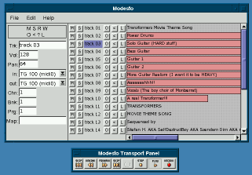

A non-linear video-, audio- and midi editor... which can record and play midi and nothing else yet and never.

# Notes

install resource data under:
  /usr/share/modesto/&lt;version&gt;/...

# Known Issues:

## Capturing Video

Capturing DV on a AMD K6 500MHz systems results in lost ISO packages.

Using the 'capture' program as root results in less lost ISO packages
when nothing else is done on the machine.

* capturing video frames causes trouble: some iso packages get lost on
  my AMD K6 500MHz system with kernel 2.4.20; the non-threaded capture.cc
  is doing a better job than modesto but is still losing frames; anyway,
  dvconnect fails completly on my system

* playing long sequences: after some time the sound is to early, some pictures
  jump in from the future more than 1s away
  -> most frames are behind?
  the non-threaded dviola has no problems
* there seems to be a problem with TOAD's memory debugging compiled in but
  not enabled via command line: some memory allocations aren't freed
* must stop videomonitor thread when it's window is closed
* received Firewire Bus Reset: not handled yet, when firewire cables is
  removed or camera is switched of
* gui, video and audio seem to run fine alone but not together
  => audio decoding seems to have most problems, don't use libdv to extract
     audio data

* Other Interesting Resources:
o http://www.schirmacher.de/
o http://www.gstreamer.net/
o http://gnonlin.sourceforge.net/

TFirewireDevice
  initialize
  
TFirewireDevice::TReader [thread]
  
# Capturing MIDI

Works.